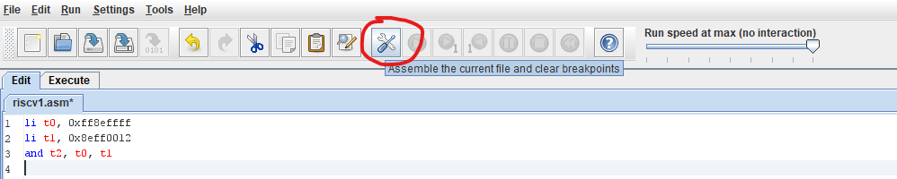
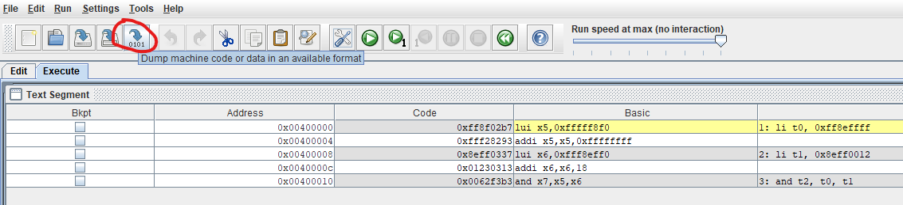
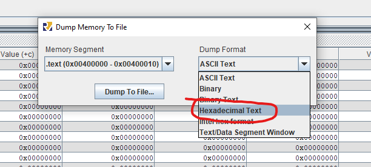

== Introduction

This is semestral work for https://bilakniha.cvut.cz/en/predmet6701806.html[Architecture of Computer Systems course] at https://fit.cvut.cz/en[FIT CTU]. `test.v` file and module declaration for processor and gpr_set in `CPU.v` file was provided.

The goal of this work was to design and describe a processor using Verilog HDL that could run a subset of RISC-V instruction and one custom instruction. <<supported,List of supported instruction>>, <<howitworks, How does it work>>

The other goal was to write simple program in assembly for this processor. This program can be run on the processor (<<runningprograms,Running programs on this CPU>>).
There are also some other test programs in assembly. <<customprograms,List of programs>>

I recommend converting assembly to binary code using https://github.com/blazekd/rars[my fork of RARS (RISC-V Assembler and Runtime Simulator)]. It adds custom `adduqb` instruction that this processor supports. <<rars,More info about converting to binary here>>

NOTE: This is my favourite school work. I never thought I could be able to make a CPU and even run my own code on it. It was very rewarding :)

== Supported instructions [[supported]]

[cols="5,7,10,10"]
|====
<h| Instruction  <h| Usage  <h| Result  <h| Description
| add    | add rd, rs1, rs2    | rd <- [rs1] + [rs2];    | Set rd to sum of rs1 and rs2. 
| addi    | addi rd, rs1, imm~11:0~    | rd <- [rs1] + imm~11:0~;    | Set rd to sum of rs1 and 12-bit immediate.
| adduqb   | addu.qb rd, rs1, rs2   |  rd~31:24~ <- [rs1~31:24~] + [rs2~31:24~]; +
  rd~23:16~ <- [rs1~23:16~] + [rs2~23:16~]; +
  rd~15:8~ <- [rs1~15:8~] + [rs2~15:8~]; +
  rd~7:0~ <- [rs1~7:0~] + [rs2~7:0~];  | User-defined SIMD instruction.
Add packed byte integers from rs1 and rs2 to rd. Ignore carry if bytes overflow.
| and    | and rd, rs1, rs2    | rd <- [rs1] & [rs2];  | Set rd to bitwise and between rs1 and rs2.
| sub    | sub rd, rs1, rs2        | rd <- [rs1] - [rs2];    | Subtract rs2 from rs1 and save result to rd.
| slt    | slt rd, rs1, rs2   | if [rs1] < [rs2] then +
&emsp;&emsp;rd<-1; +
else +
&emsp;&emsp;rd<-0;  | Set rd to 1 if rs1 is less than rs2, else set rd to 0.
| beq    | beq rs1, rs2, imm~12:1~    | if [rs1] == [rs2] then +
&emsp;&emsp;goto [PC]+{imm~12:1~,'0'}; +
else +
&emsp;&emsp;go to [PC]+4;    | If rs1 and rs2 are equal jump to [PC] + immediate, else go to next instruction.
| lw     | lw rd,imm~11:0~(rs1)      | rd <- Memory++[++[rs1] + imm~11:0~++]++  | Set rd to content of memory at address rs1 + immediate.
| sw     | sw rs2,imm~11:0~(rs1)      | Memory++[++[rs1] + imm~11:0~++]++ <- [rs2];  | Store rs2 to memory at address rs1 + immediate.
| lui   | lui rd, imm~31:12~  | rd <- {imm~31:12~,'0000 0000 0000'};  | Set upper 20 bits of rd to immediate.
| jal   | jal rd, imm~20:1~   | rd <- [PC]+4; +
goto [PC] +{imm~20:1~,'0'};  | Set rd to next instruction and jump to [PC] + immediate.
|  jalr   | jalr rd, rs1, imm~11:0~   |  rd <- [PC]+4; +
goto [rs1]+imm~11:0~;   | Set rd to next instruction and jump to [rs1] + immediate.
| auipc    | auipc rd,imm~31:12~    | rd <- [PC] + {imm~31:12~,'0000 0000 0000'};    | Set rd to [PC] + {imm[31,12], '0000 0000 0000'}. It is used to make program counter relative addresses.
| sll    | sll rd, rs1, rs2   | rd <- [rs1] << [rs2];    | Logical shift to left of value rs1 by rs2 and save result to rd.
| srl   | srl rd, rs1, rs2  |  rd <- (unsigned)[rs1] >> [rs2];   | Logical shift to right of value rs1 by rs2 and save result to rd.
| sra    | sra rd, rs1, rs2    | rd <- (signed)[rs1] >> [rs2];  | Arithmetical shift to right of value rs1 by rs2 and save result to rd.

|====

* `rd` - destination register
* `rs1`, `rs2` - source registers
* `imm~x:y~` - immediate value of length (x-y) bits
* `rd~x:y~`, `rs1~x:y~`, `rs2~x:y~` - bits from register between indexes x and y
* `[rd]`, `[rs1]`, `[rs2]` - value of register
* `Memory[x]` - memory at address x
* `{imm[31:12],'0000 0000 0000'}` - concatenate values
* `[PC]` - value of program counter = address of current instruction 

=== Binary code representation of instructions
Registers are encoded using their 5-bit encoding. https://en.wikichip.org/wiki/risc-v/registers[Can be found here]
[cols="10, 17,15,15,15,15,17"]
|===
<h|Instruction <h| 31:25 bits <h| 24:20 bits <h| 19:15 bits <h| 14:12 bits <h| 11:7 bits <h| 6:0 bits
|add ^| 0000000 ^| rs2 ^| rs1 ^| 000 ^| rd ^| 0110011 
|addi 2+^| imm[11:0] ^| rs1 ^| 000 ^| rd ^| 0010011 
|adduqb ^| 0000000 ^| rs2 ^| rs1 ^| 000 ^| rd ^| 0001011 
|and ^| 0000000 ^| rs2 ^| rs1 ^| 111 ^| rd ^| 0110011 
|sub ^| 0100000 ^| rs2 ^| rs1 ^| 000 ^| rd ^| 0110011 
|slt ^| 0000000 ^| rs2 ^| rs1 ^| 010 ^| rd ^| 0110011 
|beq ^| imm[12\|10:5] ^| rs2 ^| rs1 ^| 000 ^| imm[4:1\|11] ^| 1100011
|lw 2+^| imm[11:0] ^| rs1 ^| 010 ^| rd ^| 0000011
|sw ^| imm[11:5] ^| rs2 ^| rs1 ^| 010 ^| imm[4:0] ^| 0100011
|lui 4+^| imm[31:12] ^| rd ^| 0110111
|jal 4+^| imm[20\|10:1\|11\|19:12] ^| rd ^| 1101111
|jalr 2+^| imm[11:0] ^| rs1 ^| 000 ^| rd ^| 1100111 
|auipc 4+^| imm[31:12] ^| rd ^| 0010111
|sll ^| 0000000 ^| rs2 ^| rs1 ^| 001 ^| rd ^| 0110011 
|srl ^| 0000000 ^| rs2 ^| rs1 ^| 101 ^| rd ^| 0110011 
|sra ^| 0100000 ^| rs2 ^| rs1 ^| 101 ^| rd ^| 0110011
|===

== How does this CPU work [[howitworks]]

There are two files that are related to the CPU - `CPU.v` and `test.v`. In the first one is the definition of CPU - ALU, controller, program counter, GPR set, immediate decoder. `test.v` is for running the processor. It loads data memory and program memory and then starts execution on CPU. If the processor needs to access memory, this module is responsible for providing the access to it. It also provides clock pulses. In the end it saves value of memory and state of registers at the end of the program to `memfile_data_actual.out` nad `memfile_data_actual_REGS.out`.

Data memory is loaded in file `test.v` on line 22 from file `memfile_data.hex`.
Program memory is loaded on line 38 from file `prog1.hex`.

CAUTION: These files are expected to be exactly 64 hexadecimal 32 bit numbers written as text. If there are less programs *can* still work correctly, however if there are more then some edits to the `test.v` are necessary in the data_mem and/or inst_mem modules.

== Custom programs [[customprograms]]

Programs are made using assembly and then they need to be converted to binary representation (program memory). Assembly files have extension `.asm` and binary representation uses extension `.hex`. +
<<howitworks, More info on how .hex files should look>> +
<<rars, How to convert .asm to .hex>>

=== Prog1 - image merging
`prog1.asm` (`prog1.hex`) merges two images saved in memory into one. These images are in custom format. This program is routine that takes 3 arguments - address of first image, address of second image and address of output image. Calls of this routine follows RISC-V calling conventions. These arguments are saved in data memory on these addresses:

.Addresses
* 0x00000004: first input image address
* 0x00000008: second input image address
* 0x0000000C: output image address

It also saves total count of pixels to address 0x00000010.
The algorithm for merging adds together every color channel of input pixel (doesn't care about overflow) and sets the alpha channel to 0xff. 

This program doesn't check dimensions of image and can only merge images of the same size. After running the program, the result image can be found in memory (file `memfile_data_actual.out`) on the specified output address.

==== Image format
Image starts with 4-byte signature `0x5350412e` (".APS" in ASCII) followed by 4-byte width of image and 4-byte height of image. After that there are pixels of image. One pixel is 4 bytes and codes following channels in this order: red, greed, blue and alpha. Red channel is least significant bit, alpha is the most significant bit.

Example of image in hex:
----
5350412e
00000002
00000003
11223300
2200aaff
00ffff00
03565654
1b459748
ecf39baa
----

=== Arithmetic
`arithmetic.asm` (`arithmetic.hex`) performs some simple arithmetic to test the processor. It doesn't work with data memory, so it doesn't have custom `memfile_data.hex`.

=== Jump
`jump.asm` (`jump.hex`) performs some simple jumps to test the processor. It doesn't work with data memory, so it doesn't have custom `memfile_data.hex`.

== Running programs [[runningprograms]]

To run programs on this CPU you first need to to <<rars, convert them to .hex>>. This is just hexadecimal text representation of the program. If you use data memory you also need to create .hex data memory file (by default named `memfile_data.hex`). 

If you have all these set up then you can run command `iverilog test.v` which creates `a.out` executable. If you are using Linux you can just run this executable with `./a.out`. If you are using Windows you need to use command `vvp a.out`.

This runs the simulation and creates file `test.vcd`. You can inspect this file with `gtkwave`. You can also notice that the files `memfile_data_actual.out` and `memfile_data_actual_REGS.out` were created. These files contain data memory and values of CPU registers at the end of the simulation.

=== Using RARS (RISC-V Assembler and Runtime Simulator) to convert `.asm` to `.hex`[[rars]]

I recommend using https://github.com/blazekd/rars[my fork of RARS (RISC-V Assembler and Runtime Simulator)]. It adds custom `adduqb` instruction that this processor supports.

==== Converting `.asm` to `.hex` format
1. Create/open assembly file
2. Save it as `.asm` file
3. Assemble it 
+

+
4. Dump the code 
+

+
5. Select **Hexadecimal Text** as format 
+

+
6. Save dump as `.hex` file
7. (Recommended) Check the number of lines of your program. If it is less then 64 pad it with 00000000 and if it is more make sure you edit `test.v` file so you can use more memory. Also don't forget to change corrent lines in `test.v` if your files are named differently. <<howitworks,More info here>>
